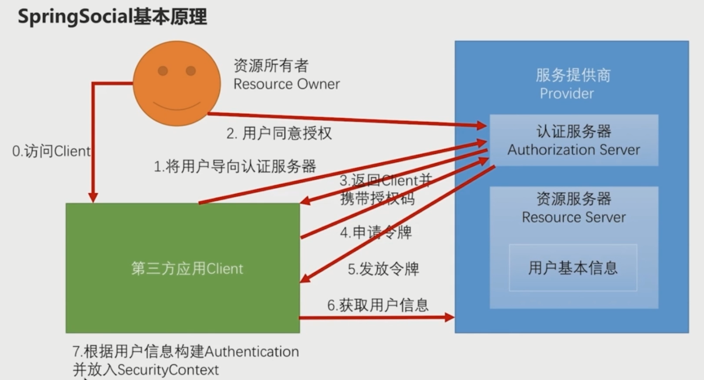
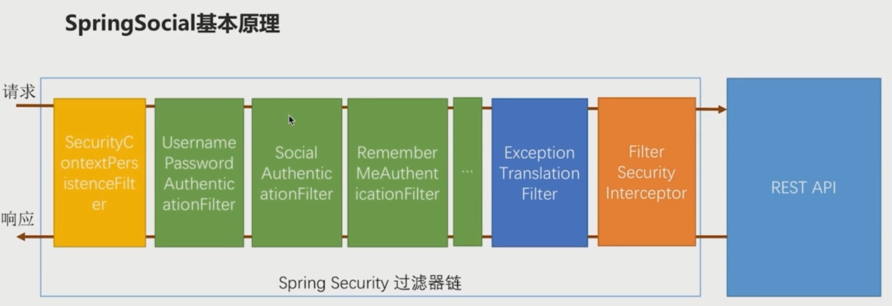
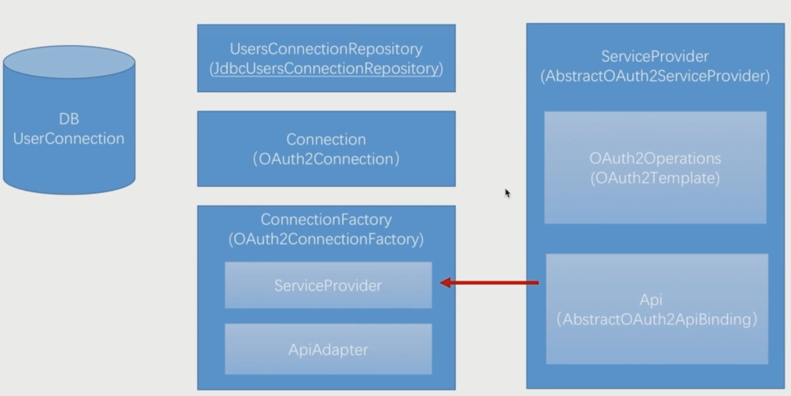

# 使用SpringSocial集成第三方登陆(github/qq)
[运行步骤](./running.md)
### SpringSocial实现第三方登陆基本原理

SpringSocial就是将这一整个流程封装起来并且去进行实现

它把整个流程封装到了SocialAuthenticationFilter的过滤器中然后把这个过滤器加入到了SpringSecurity的过滤器链上。当访问请求的时候，SocialAuthenticationFilter会将请求拦截下来然后将整个流程走完。进而去实现第三方登录。
### 具体接口和相关实现

在整个流程上面，从第一步到第六步，都是需要跟服务提供商打交道的。所以它的第一个接口叫--ServiceProvider,它实际上就是服务提供商的一个抽象，针对每一个服务提供商（QQ、微信），都需要一个ServiceProvider接口的一个实现。SpringSocial提供了一个AbstractOauth2ServiceProvider抽象类，实现了一些共有的东西，如果要自己写，只需要继承这个类实现其中的公有方法即可。  

针对①和②，SpringSocial提供了两个接口：
1. Oauth2Operation（封装第一步到第五步）。Spring提供了一个默认的实现叫Oauth2Template,这个类会帮助我们去完成Oauth协议的执行流程。
2. Api（个性化第六步），实际上没有一个明确的接口，因为每一个服务提供商对于用户基本信息的调用都是有区别的。SpringSocial其实也提供了一个抽象类叫AbstractOauth2ApiBinding帮助我们快速开发第六步的实现。  

到了第七步实际上就跟服务提供商没有任何关系了。都是在第三方应用Client内部去完成的。
1. 第一个接口是Connection，SpringSocial提供的实现类叫OAuth2Connection。其作用是封装前六步执行完毕之后获取到的用户信息。
2. Connection是由ConnectionFactory创建出来的，用到的类叫OAuth2ConnectionFactory。它的作用就是为了创建Connection对象获取用户信息，但是用户信息是在ServiceProvider中去构建的。所以在OAuth2ConnectionFactory中肯定有一个ServiceProvider实例，将ServiceProvider封装起来放到Connection中去。

ConnectionFactory中有一个ApiAdapter，将不同格式的用户信息转化为固定格式的Connection对象就是由ApiAdapter接口的实现来完成。转化成功之后就将Connection中封装进去一个用户信息。  

### 说明
基本流程等解释内容都来源于相关网络博客