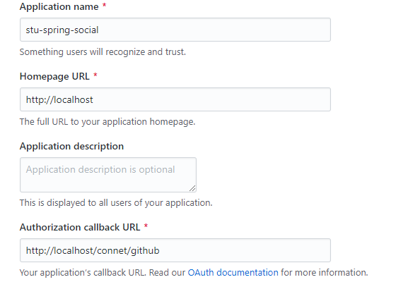

### 由于qq登陆申请缓慢麻烦 这里演示github登陆流程
项目下下来github登陆可以直接测试使用  
如果想自己配置步骤如下
1. github上Settings/Developer settings申请OAuth Apps

2. 修改application-formal.yml文件,替换security/social/github下app-id,app-secret参数
3. 如果需要修改URL需要同步修改login.html的登陆地址
4. 启动系统测试  

